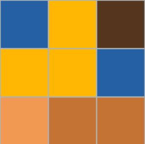
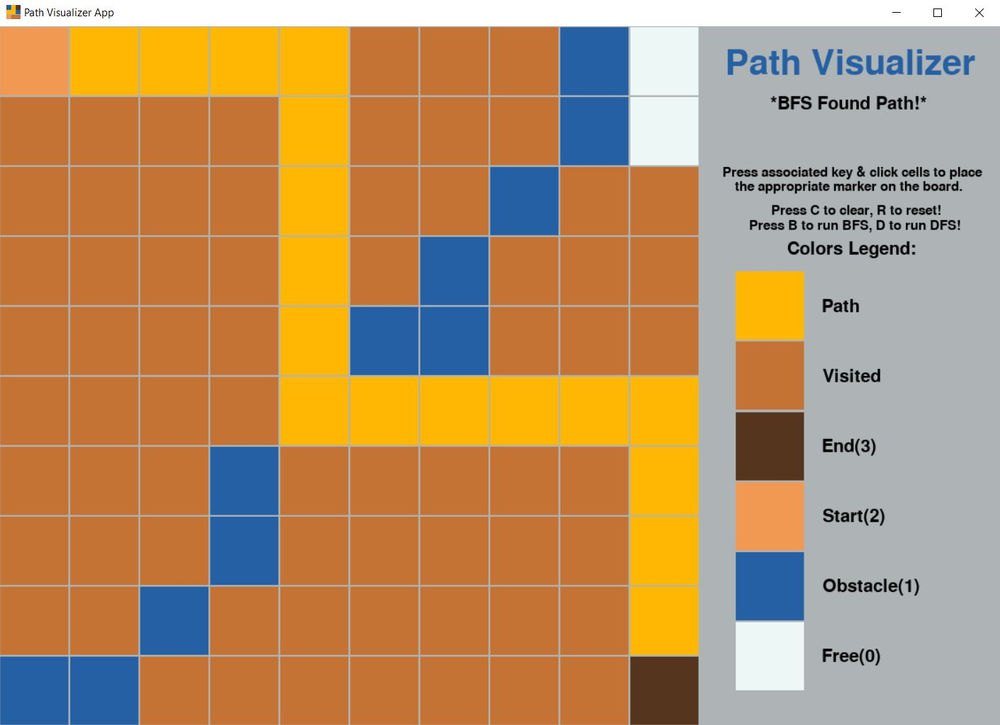

# Path Visualizer


Path Visualizer is a pygame based GUI application that allows users to draw mazes, i.e. mark cells as free or blocked, and run BFS or DFS on them to find paths between a start & end cell.

## Getting Started

To get started:

1. Run ```pip install -r requirements.txt```
1. Start the application by running ``` python main.py ```

## Usage



The application is based off a 10x10 grid where each cell can be marked by pressing the associated key once and mouse clicking as many cells as needed.

Markers Available:

- <kbd>Num. 0</kbd> marks free cell
- <kbd>Num. 1</kbd> marks obstacle
- <kbd>Num. 2</kbd> marks start
- <kbd>Num. 3</kbd> marks end

To find a path between the start and end nodes, you can either press <kbd>D</kbd> for DFS (Depth-First Search) or <kbd>B</kbd> for BFS (Breadth-First Search).

Lastly, to clear the grid you can press <kbd>C</kbd> and to reset the grid to the default board you can press <kbd>R</kbd>.
